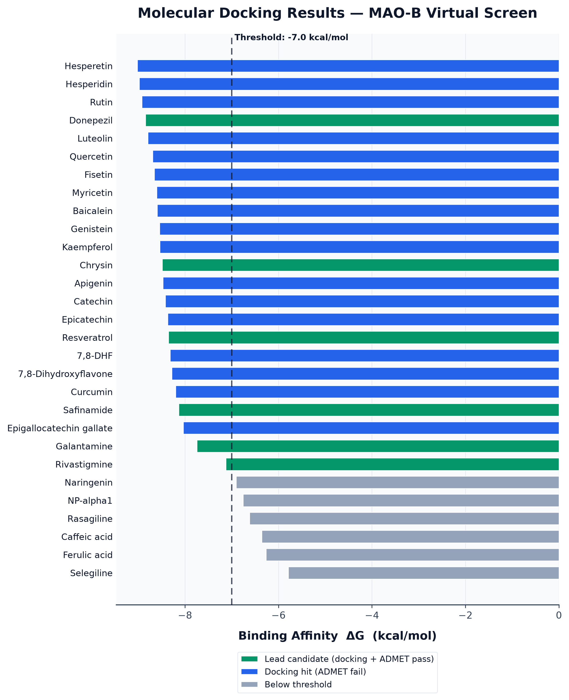
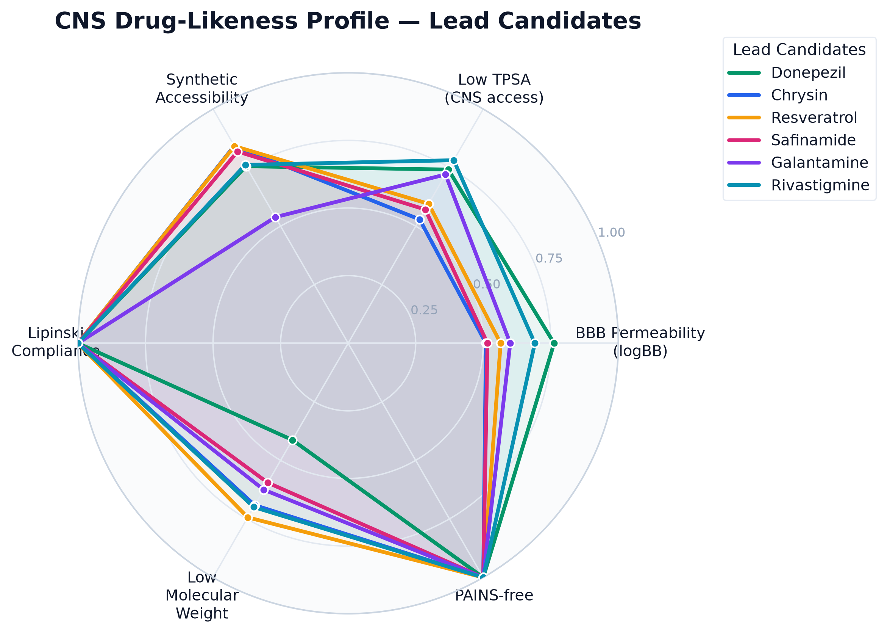
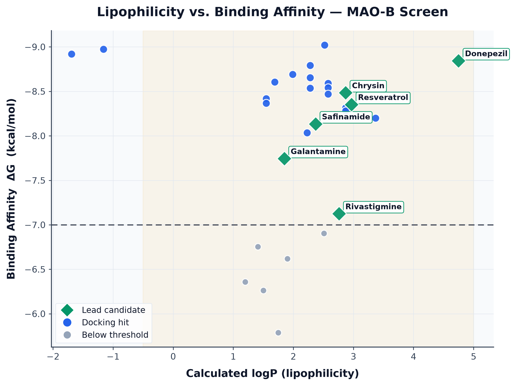
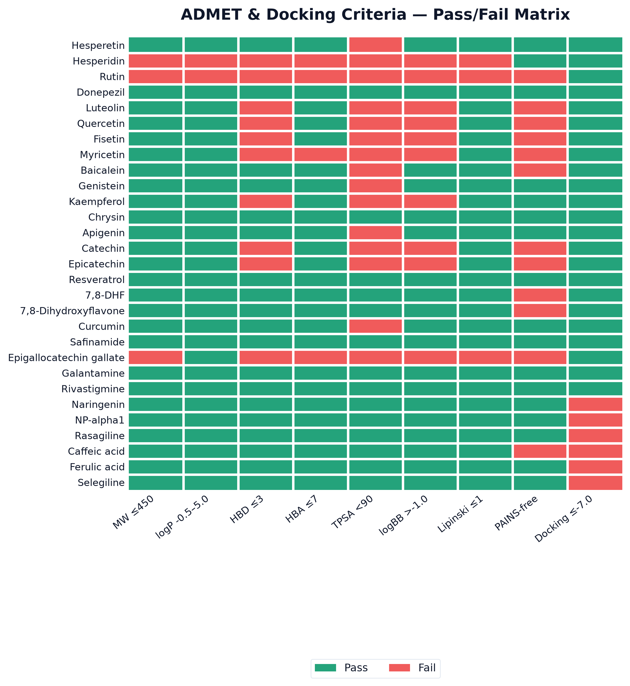
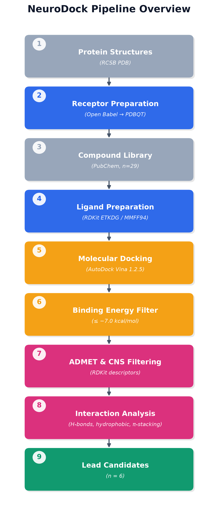

# NeuroDock — Computational Drug Discovery Pipeline

[](https://www.python.org/)
[](LICENSE)
[]()
[](https://https://neurodock-9agfknnfhnmgsxexmeffjm.streamlit.app/)

**NeuroDock** is a fully open-source, end-to-end virtual screening pipeline for
computational drug discovery targeting neurodegeneration. One command takes you
from SMILES strings to publication-quality results.

---

## Live Demo

**Try the interactive app:** [NeuroDock on Streamlit](https://https://neurodock-9agfknnfhnmgsxexmeffjm.streamlit.app/)

Explore all docking results, ADMET profiles, nitrosamine risk assessments,
and publication figures — without installing anything.

---

## Pipeline

```
PubChem API -> 3D Ligand Prep -> AutoDock Vina Docking -> ADMET Filtering
           -> Interaction Analysis -> Nitrosamine Risk -> Figures + Report
```

---

## Results

### Figure 1 — Binding Affinity Rankings (All 29 Compounds)


### Figure 2 — CNS Drug-Likeness Profile (Lead Candidates)


### Figure 3 — Lipophilicity vs Binding Affinity


### Figure 4 — ADMET Pass/Fail Matrix (All 29 Compounds)


### Figure 5 — Pipeline Overview


---

## Lead Candidates

| Compound | dG (kcal/mol) | logBB | TPSA | MW | Nitrosamine Risk |
|---|---|---|---|---|---|
| Donepezil | -8.84 | +0.287 | 38.77 | 393.5 | MODERATE-HIGH |
| Chrysin | -8.48 | -0.470 | 70.67 | 254.2 | LOW |
| Resveratrol | -8.35 | -0.307 | 60.69 | 228.3 | LOW |
| Safinamide* | -8.13 | -0.453 | 64.35 | 302.4 | MODERATE |
| Galantamine* | -7.74 | -0.200 | 41.93 | 287.4 | MODERATE |
| Rivastigmine* | -7.12 | +0.073 | 32.78 | 250.3 | HIGH |

*Clinically approved CNS drugs recovered as internal pipeline validation.

---

## Features

- Automated compound retrieval via PubChem PUG REST API with CID verification
- 3D conformer generation with RDKit ETKDGv3 + MMFF94 (fixed seed, reproducible)
- Molecular docking with AutoDock Vina 1.2.5 (exhaustiveness=16, 9 binding modes)
- CNS ADMET filtering: MW, logP, HBD/HBA, TPSA, logBB, Lipinski, PAINS
- Protein-ligand interaction analysis: H-bonds, hydrophobic, salt bridges, pi-stacking
- Nitrosamine impurity risk: ICH M7(R2) / EMA-FDA 2023 framework
- 5 publication-quality figures at 300 DPI
- Auto-generated PDF and CSV reports

---

## Quick Start

```bash
# 1. Clone
git clone https://github.com/ThanuHith/neuro_dock.git
cd neuro_dock

# 2. Create virtual environment
python3 -m venv venv
source venv/bin/activate

# 3. Install Python packages
pip install -r requirements.txt

# 4. Install AutoDock Vina + Open Babel
bash scripts/install_tools.sh

# 5. Run the pipeline
python3 run_pipeline.py
```

Results appear in `data/results/`.

---

## Project Structure

```
neuro_dock/
+-- run_pipeline.py          # Main orchestrator - run this
+-- app.py                   # Streamlit interactive app
+-- config/
|   +-- settings.py          # Targets, ligands, thresholds
+-- modules/
|   +-- protein_prep.py      # PDB download + PDBQT conversion
|   +-- ligand_prep.py       # SMILES to 3D to PDBQT
|   +-- docking.py           # AutoDock Vina wrapper
|   +-- scorer.py            # Binding energy filtering
|   +-- admet.py             # CNS ADMET + PAINS screening
|   +-- interaction.py       # Protein-ligand interactions
|   +-- nitrosamine.py       # ICH M7 nitrosamine risk assessment
|   +-- figures.py           # Publication figure generation
|   +-- reporter.py          # CSV output
|   +-- pdf_report.py        # PDF report generation
|   +-- pubchem_fetch.py     # PubChem API retrieval
+-- data/
|   +-- proteins/            # PDB + PDBQT receptor files
|   +-- ligands/             # Prepared ligand PDBQT files
|   +-- results/             # All outputs (CSV, PDF, figures)
+-- scripts/
|   +-- install_tools.sh     # System tool installer
+-- requirements.txt
+-- LICENSE
+-- README.md
+-- app.py                   # Streamlit app
```

---

## Citation

```
Thanuhith J. (2025). In Silico Identification of Donepezil and Natural
Polyphenols as Monoamine Oxidase-B (MAO-B) Inhibitors: A Structure-Based
Virtual Screening, ADMET Profiling, and Protein-Ligand Interaction Study.
Dr. M.G.R. Educational and Research Institute, Chennai, India.
GitHub: https://github.com/ThanuHith/neuro_dock
```

## Author

**Thanuhith J.** | Department of Pharmacy
Dr. M.G.R. Educational and Research Institute, Chennai, Tamil Nadu, India

## License

MIT License - free to use, modify, and distribute with attribution.
